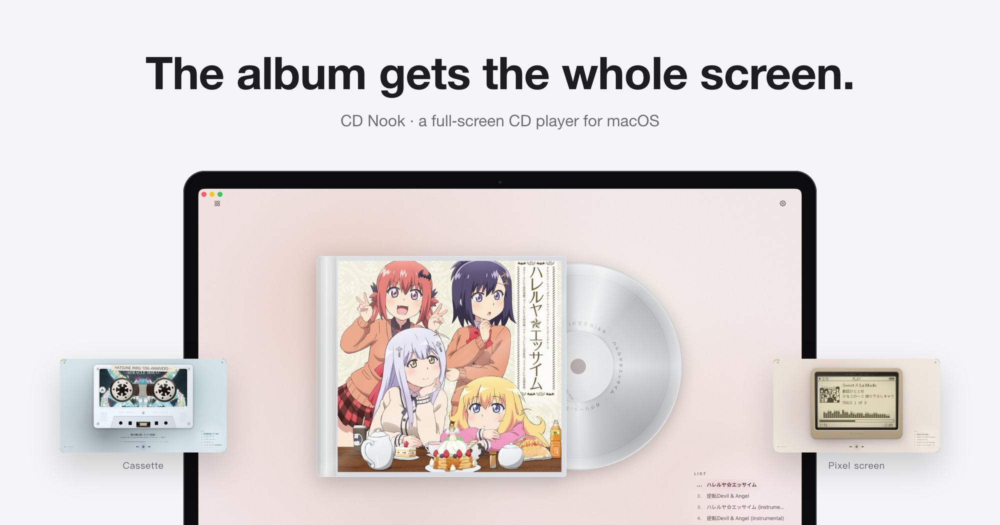
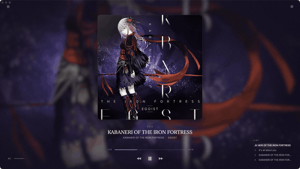
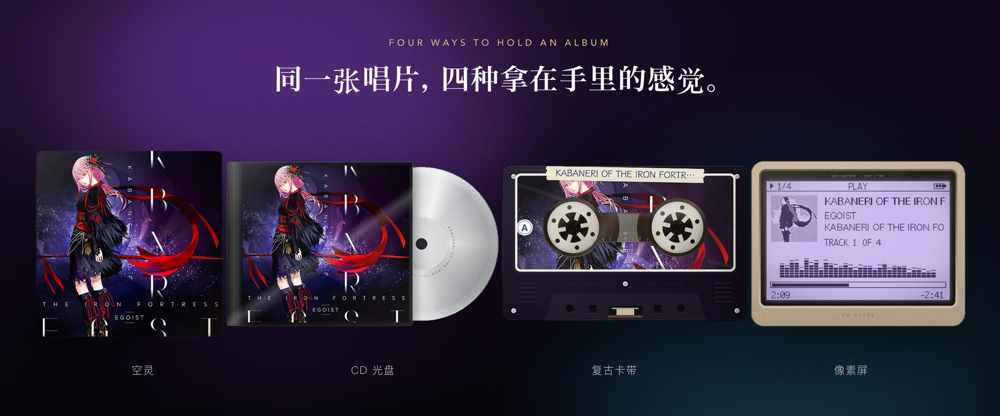
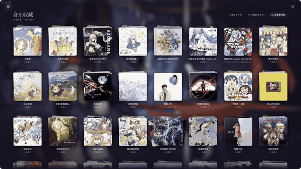

<picture>
  <source media="(prefers-color-scheme: dark)" srcset="docs/media/banner-en-dark.jpg">
  
</picture>

<h1 align="center">CD Nook</h1>

<p align="center"><b>A full‑screen CD player for macOS. Whatever's playing gets the whole screen.</b></p>

<p align="center"><a href="README.md">中文</a> · <a href="README.ja.md">日本語</a> · <a href="CHANGELOG.md">Changelog</a></p>

---

People who still buy CDs buy the artwork too. CD Nook puts the album you're playing across the entire screen — floating in soft light, inside a clear jewel case, printed on a cassette, or drawn on a dot‑matrix screen. Your anime CDs stack up by series into a wall that bursts open with a ripple.

<p align="center"></p>

## Features

### Four ways to hold an album

<p align="center"></p>

- **Ethereal** — the sleeve floats in drifting light.
- **CD** — a clear jewel case with a silver disc that turns while it plays.
- **Cassette** — the cover printed on a tape whose packs follow the album's progress; three looks: label print, full‑shell print, tinted shell + sticker.
- **Pixel screen** — a khaki dot‑matrix player; the cover's subject is lifted with Vision and drawn in 1‑bit dots.

Eight tones and three backgrounds combine with any style. `⌘1`–`⌘4` switch styles.

### The album wall

<p align="center"></p>

Scan any folder tree; anime CDs are grouped by series and stacked. Hover to fan a stack, click and a ripple blurs the wall while the CDs burst out around the title (all 37 at once, if that's what you have). Pick one and it flies into the player; come back and the whole page shrinks into that CD. The wall follows the player's style and tone.

### Every disc taken seriously

- **Audio CDs** play full screen on insert; MusicBrainz Disc ID finds titles and artwork.
- **Folders**: WAV, AIFF, MP3, M4A, FLAC, OGG; single‑file FLAC split by CUE; `album.json` overrides.
- **Artwork** from folder images, CUE `REM COVER`, embedded FLAC pictures, or online candidates (MusicBrainz / Cover Art Archive, Apple Music, Moegirl, Wikipedia) you can preview and pick.
- **On‑device enhancement** of small covers with Real‑ESRGAN on the Apple GPU — nothing is uploaded.
- **Survives disk drop‑outs**: if an external drive or an SSH / SMB mount stops answering, CD Nook says which one and offers *Retry* instead of freezing.

## Install

Download `CD Nook macOS 26.zip` from [Releases](../../releases) and move **CD Nook.app** to Applications. It is ad‑hoc signed, so open it the first time with right‑click → Open (or run `xattr -dr com.apple.quarantine "/Applications/CD Nook.app"`). Requires macOS 26 on Apple silicon; VLC is bundled.

## Build

```bash
./build.sh
```

Needs the macOS 26 SDK. libVLC 3.0.21 (headers, libraries, 66 audio plugins) lives in `vendor/VLC`, Real‑ESRGAN in `vendor/RealESRGAN`. See the Chinese README for tests and the source layout.

## Credits

VLC 3.0.21 (LGPL‑2.1), Real‑ESRGAN ncnn Vulkan (BSD‑3‑Clause), AnimeGarden bgmd (MIT) and Bangumi artwork paths. Album art shown in screenshots and videos belongs to its respective rights holders and appears only to demonstrate playback.

## License

The CD Nook code is released under the [MIT License](LICENSE). Bundled third‑party components (VLC, Real‑ESRGAN, the anime title index) keep their own licenses, and the album artwork in the screenshots and the bundled idle sleeve (`icon/IdleCover.jpg`) belongs to its respective owners — it is not covered by the MIT License (see [NOTICE.md](NOTICE.md)).
