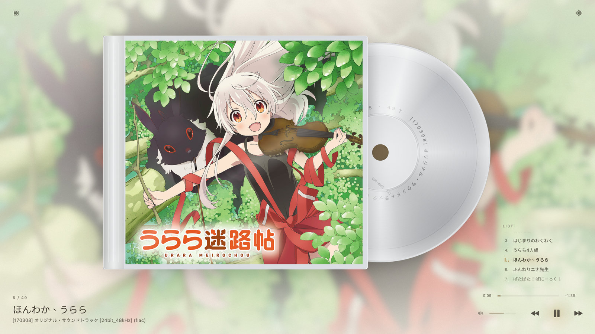
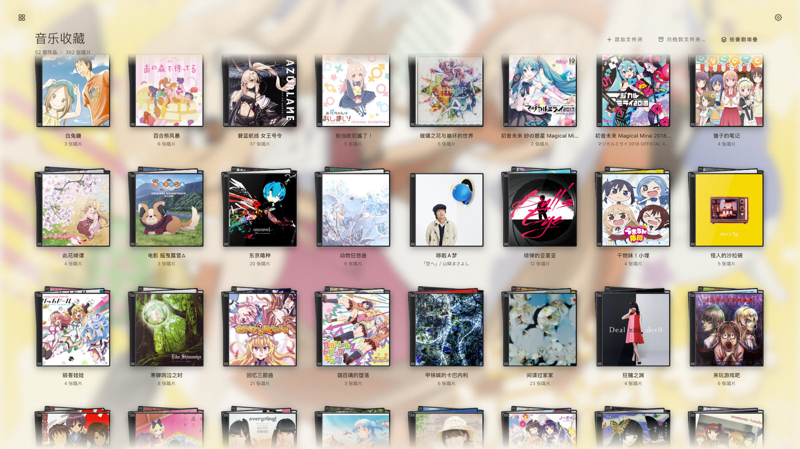
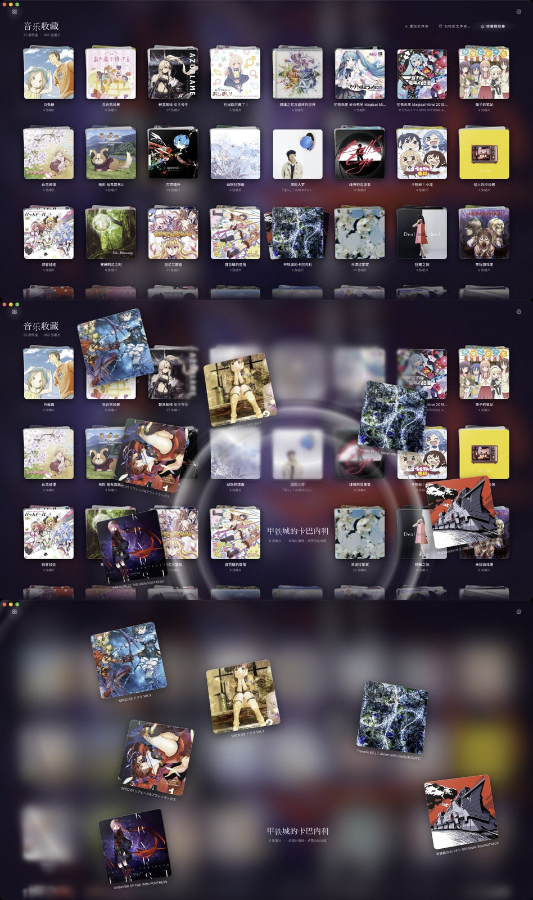
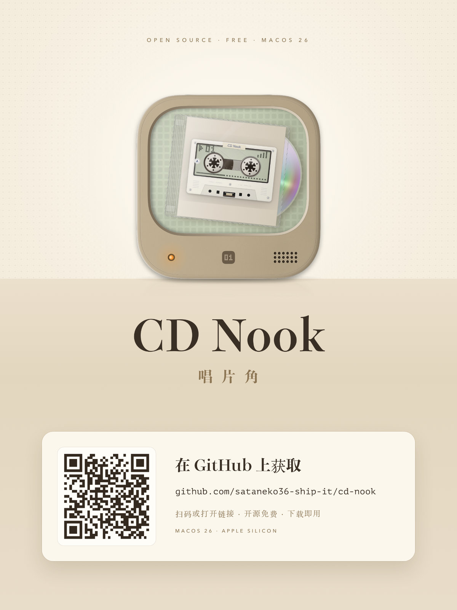

<p align="center"></p>

<h1 align="center">CD Nook</h1>

<p align="center"><b>Mac のためのフルスクリーン CD プレーヤー。ジャケットが、画面いっぱいに。</b></p>

<p align="center"><a href="README.md">中文</a> · <a href="README.en.md">English</a></p>

---

CD を買うとき、私たちは音楽だけでなくジャケットも買っています。CD Nook は再生中のアルバムを画面いっぱいに映します——やわらかな光の中に浮かべたり、透明なジュエルケースに入れたり、カセットに刷ったり、ドット液晶に描いたり。アニメ CD は作品ごとに積み重なり、クリックすると波紋とともに広がります。

<p align="center"></p>

## 特長

- **4 つの見た目**：空灵（エセリアル）/ CD ジュエルケース / レトロカセット / ドット液晶。`⌘1`〜`⌘4` で切り替え。
- **8 つのカラーテーマ**と 3 種類の背景（単色・ジャケットぼかし 3 段階・ジャケットの色）。
- **カセット**はジャケットの刷り方が 3 種類：ラベル / シェル全面 / 色つきシェル＋ステッカー。リールは再生の進み具合に合わせて巻き取られます。
- **ドット液晶**：Vision でジャケットの主役を切り抜き、1 ビットのドットで描きます。
- **アルバムウォール**：作品ごとに CD を自動で積み重ね。ホバーで扇状に開き、クリックすると波紋がぼかしながら広がり、CD が花火のように散らばります。選んだ 1 枚はプレーヤーへ飛び込み、戻るとページ全体がその CD に吸い込まれます。
- **実体 CD** は挿入するだけで全画面再生。MusicBrainz Disc ID で曲名とジャケットを取得。
- **FLAC + CUE** の一枚ファイルも曲ごとに再生。ジャケットはフォルダ画像・CUE・FLAC 埋め込みから。見つからなければ MusicBrainz・Apple Music・萌娘百科・Wikipedia から候補を探します。
- **Real‑ESRGAN** による小さなジャケットの高画質化を Mac 上で（アップロードなし）。
- 外付けディスクや SSH / SMB の接続が切れても固まらず、「再試行」を出します。

<p align="center"></p>

<p align="center"></p>

## インストール

[Releases](../../releases) から `CD Nook macOS 26.zip` をダウンロードし、**CD Nook.app** をアプリケーションへ。アドホック署名のため、初回は右クリック →「開く」で起動してください。macOS 26・Apple シリコンが必要です（VLC は同梱）。

<p align="center"><a href="../../releases"></a></p>

## ビルド

```bash
./build.sh
```

スクリーンショットや動画、アプリ内の起動画面（`icon/IdleCover.jpg`）に写っているジャケット（『甲鉄城のカバネリ』『ガヴリールドロップアウト』『初音ミク』『ひなこのーと』など）の権利は各権利者に帰属し、再生画面の紹介のためにのみ使用しています。

## ライセンス

CD Nook のコードは [MIT ライセンス](LICENSE) で公開しています。同梱のサードパーティ製コンポーネント（VLC・Real‑ESRGAN・アニメ作品名インデックス）はそれぞれのライセンスに従い、ジャケット画像は MIT ライセンスの対象外です（[NOTICE.md](NOTICE.md) を参照）。
