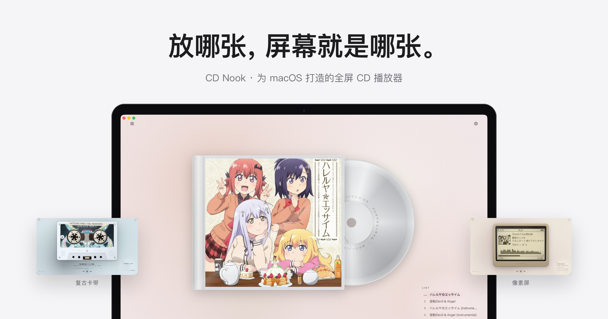
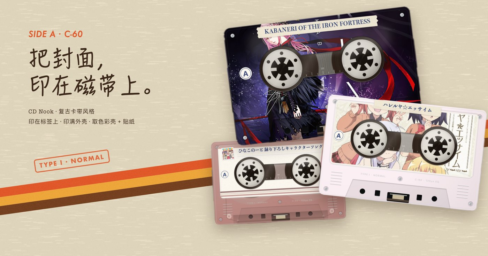
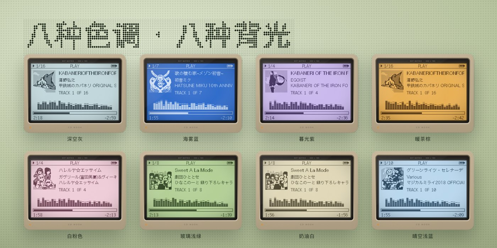

<picture>
  <source media="(prefers-color-scheme: dark)" srcset="docs/media/banner-dark.jpg">
  
</picture>

<h1 align="center">CD Nook</h1>

<p align="center"><b>为 macOS 打造的全屏 CD 播放器。放哪张，屏幕就是哪张。</b></p>

<p align="center">
  
  
  
  
  
</p>

<p align="center">
  <a href="README.en.md">English</a> · <a href="README.ja.md">日本語</a> · <a href="CHANGELOG.md">更新记录</a>
</p>

---

买 CD 的人买的不只是音乐，还有那张封面。CD Nook 把正在播放的专辑铺满整块屏幕：漂浮在柔光里、装进透明 CD 盒、印在复古磁带上，或者画成一台点阵像素屏。番剧 CD 收藏会按作品叠成一面墙，点一下，唱片像烟花一样散开。

<p align="center"></p>

## 特色

### 四种外观

<p align="center"></p>

| 风格 | 看起来像 |
| --- | --- |
| **空灵** | 封面漂在流动的柔光里，带浮光粒子 |
| **CD 光盘** | 透明 CD 盒，银色光盘半露在外，随播放转动 |
| **复古卡带** | 封面印在磁带上，磁带卷随曲目进度一圈圈变化；三种封面样式：印在标签上 / 印满外壳 / 取色彩壳 + 贴纸 |
| **像素屏** | 灰棕黄外壳的点阵机：封面主体由 Vision 自动抠出，画成 1‑bit 点阵，长曲名分步滚动 |

八种色调（深空灰、海雾蓝、暮光紫、暖茶棕、白粉色、玻璃浅绿、奶油白、晴空浅蓝）和三种背景（柔光纯色、封面柔焦三档、封面取色柔焦）可以和任意风格组合。`⌘1`～`⌘4` 切换风格。

<p align="center"> </p>

### 专辑墙

<p align="center"></p>

- 扫描任意层级的文件夹，番剧 CD 按作品自动归类、叠成一摞（本机番剧别名索引 + Wikipedia / 萌娘百科核对）。
- 鼠标移上去整摞扇开；点一下，水波纹从中心扩散，扫过的地方逐渐模糊，唱片在作品名周围散开，37 张也能一次放下。
- 点开一张，它飞进播放器封面的位置；回到专辑墙时，整个播放页缩回那张唱片里。
- 墙的样子跟着播放器风格走：玻璃方片、CD 盒、贴着纸胶带的相纸印片、像素点阵。
- 没有专属封面的 CD 用番剧主视觉（本地海报 → Bangumi → Wikipedia）。
- 归档：把 CD 按番剧复制到你选的文件夹，原文件留在原处。

### 认真对待每一张盘

- **实体 CD**：插入即全屏播放，用 MusicBrainz Disc ID 识别曲目与封面，认过一次就记住。
- **虚拟 CD**：WAV / AIFF / MP3 / M4A / FLAC / OGG；整碟 FLAC 按 CUE 分轨；`album.json` 自定义专辑信息。
- **封面**：文件夹图片、CUE `REM COVER`、FLAC 内嵌图；都没有时去 MusicBrainz / Cover Art Archive、Apple Music、萌娘百科、Wikipedia 找候选，在应用里预览、切换，手动指定的会被记住。
- **画质增强**：小封面用本机 Real‑ESRGAN（Apple GPU）放大 2× / 4×，不上传云端。
- **不怕断线**：放 CD 的外接硬盘断开、SSH / SMB 挂载掉线时不会卡死——几秒内提示哪块硬盘连接不上，并提供「重试」。
- **全局高斯模糊（试验）**：0.001%～3% 的整窗模糊，用来找你喜欢的朦胧感。

## 安装

1. 从 [Releases](../../releases) 下载 `CD Nook macOS 26.zip`，解压后把 **CD Nook.app** 拖进「应用程序」。
2. 应用使用本地签名（ad‑hoc），第一次打开时请在 Finder 里**右键 → 打开**；如果系统仍然拦截，可以在终端执行：
   ```bash
   xattr -dr com.apple.quarantine "/Applications/CD Nook.app"
   ```
3. 需要 macOS 26 和 Apple 芯片的 Mac。VLC 播放核心已经内置，不需要另外安装。

## 使用

- 插入音频 CD 会自动全屏播放；没有光驱时，把音乐文件夹拖进窗口，或用 `⌘O` 打开。
- 左上角的格子按钮（或 `⌘B`）打开专辑墙；第一次先点「添加文件夹」扫描你的 CD 目录。
- 右上角齿轮里可以换风格、色调、背景、封面增强，找候选封面或手动换封面。

| 按键 | 作用 |
| --- | --- |
| `空格` | 播放 / 暂停 |
| `←` / `→` | 上一首 / 下一首 |
| `⇧←` / `⇧→` | 快退 / 快进 10 秒 |
| `↑` / `↓` | 音量 ±5 |
| `L` | 显示 / 隐藏右下角曲目列表 |
| `F` 或 `⌃⌘F` | 全屏 |
| `Esc` | 退出全屏；专辑墙打开时先收起展开的堆叠 |
| `⌘B` | 专辑墙 |
| `⌘1`～`⌘4` | 切换风格 |
| `⌘W` | 结束播放 |

## 从源码构建

需要 macOS 26 SDK（Xcode 或 Command Line Tools）。VLC 3.0.21 的头文件、库和 66 个音频插件已放在 `vendor/VLC`，Real‑ESRGAN 在 `vendor/RealESRGAN`。

```bash
./build.sh
```

应用会生成在仓库上两级的 `outputs/CD Nook.app`（可以在 `build.sh` 里改 `out=`）。测试：

```bash
# 专辑墙、返回动画、展开布局、硬盘超时……（不碰你自己的资料库）
clang -fobjc-arc -fmodules -mmacosx-version-min=26.0 tests/wall_test.m CDViews.m CDTheme.m CDVolumes.m \
  -o /tmp/wall_test -framework AppKit -framework QuartzCore -framework CoreImage && /tmp/wall_test
# 静音、在屏幕外渲染的界面截图测试
tests/snapshot.sh /tmp/shots "<音乐文件夹>" PLAN="size:1920x1080 style:2 load wait:3 snap:cassette quit"
```

`tests/hang_interpose.c` 可以模拟一块突然不响应的硬盘，用来验证断线处理。

### 代码结构

| 文件 | 内容 |
| --- | --- |
| `CDGlass.m` | 窗口、播放（libVLC）、布局、齿轮菜单、封面识别流程 |
| `CDHeroes.m` | 空灵、CD 光盘、复古卡带的绘制与材质 |
| `CDRetroPlayer.m` / `CDPixelArt.m` | 像素屏、外壳，以及封面的抠图与点阵化 |
| `CDAlbumWall.m` | 专辑墙：堆叠、展开布局、水波纹模糊、缩略图缓存、返回动画 |
| `CDLibrary.m` | 递归扫描、番剧归类、资料库与归档 |
| `CDVolumes.m` | 外接 / 网络硬盘的超时与"连接不上"状态 |
| `CDCoverSearch.m` | 在线封面候选 |
| `CDViews.m` / `CDTheme.m` | 柔光按钮、背景、进度条、列表；配色与字体 |
| `icon/` | 应用图标与生成它的代码 |
| `windows/` | Windows 预览版（独立的 WPF / .NET 实现，功能少于 macOS 版） |

## 隐私

只有在找封面、识别番剧或实体 CD 时才联网，发送的是唱片编号、专辑名、曲名或 Disc ID，不上传音频和图片。资料库、封面与偏好都保存在本机：`~/Library/Application Support/CD Glass`、`~/Library/Caches/CD Glass`（文件夹沿用改名前的 CD Glass，旧资料库可以直接用）。

## 致谢与第三方组件

- [VLC / libVLC](https://www.videolan.org/) 3.0.21（LGPL‑2.1），内置其音频部分，见 `vendor/VLC/README.md`。
- [Real‑ESRGAN ncnn Vulkan](https://github.com/xinntao/Real-ESRGAN)（BSD‑3‑Clause），见 `vendor/RealESRGAN/LICENSE`。
- 番剧名称索引来自 [AnimeGarden bgmd](https://github.com/AnimeGarden/bgmd)（MIT）与 Bangumi 海报地址，见 `data/README.md`。
- 在线封面候选来自 MusicBrainz / Cover Art Archive、Apple Music、萌娘百科与 Wikipedia 的公开接口。

截图、演示视频和应用内启动封面（`icon/IdleCover.jpg`）中出现的专辑封面（《甲铁城的卡巴内利》《珈百璃的堕落》《初音未来》《雏子的笔记》《在下坂本，有何贵干？》等）版权归各自权利方所有，仅用于展示播放效果。

## 许可证

本项目代码以 [MIT 许可证](LICENSE) 发布。内置的第三方组件（VLC、Real‑ESRGAN、番剧名称索引）按各自的许可证发布；专辑封面不在 MIT 许可范围内，见上一节与 `LICENSE` 末尾。
